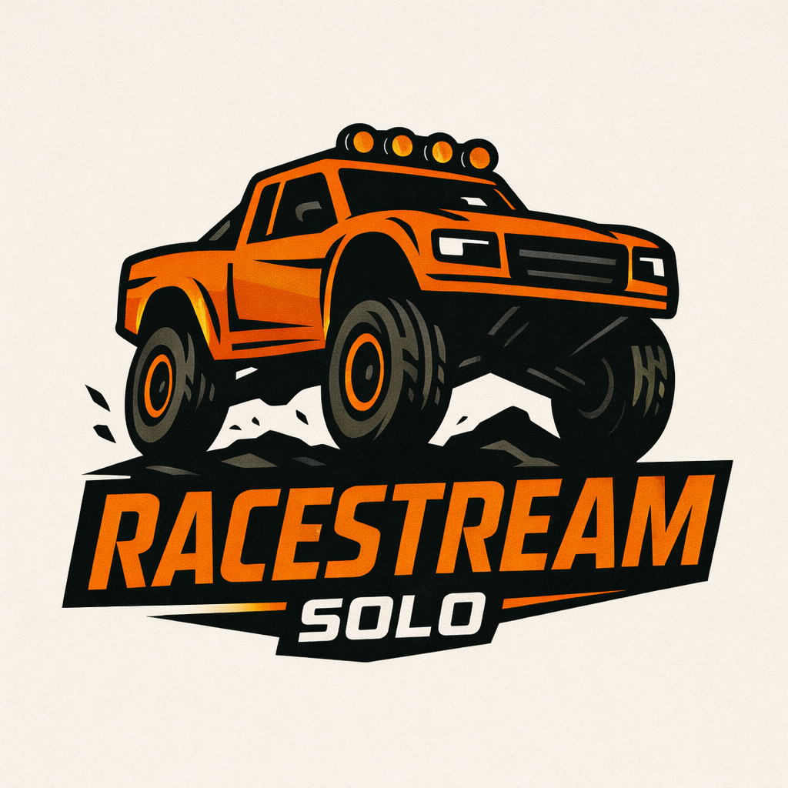

# RaceStream Solo

<p align="center">
  
</p>

<p align="center">
  <strong>Standalone Multi-Camera YouTube Streaming Device</strong>
</p>

Turn your Raspberry Pi into a professional multi-camera live streaming device. Connect USB cameras, configure via web UI, and stream directly to YouTube with automatic camera rotation.

## Features

- **Multi-Camera Support** - Connect 2+ USB cameras (webcams, GoPro, DJI Osmo Action, etc.)
- **Automatic Rotation** - Seamlessly switch between cameras at configurable intervals
- **Audio Support** - Auto-detect camera audio with smooth fade transitions
- **Web UI** - Easy configuration from any device on your network
- **Overlay Support** - Add text and timestamp to your stream
- **YouTube Integration** - Stream directly to YouTube Live
- **Camera Discovery** - Auto-detect connected cameras with audio devices
- **Network Discovery** - Access via `racestream-solo.local` on any network
- **Log Viewer** - Monitor streaming status in real-time

## Quick Install

On your Raspberry Pi, run:

```bash
curl -fsSL https://raw.githubusercontent.com/jeffwoolums/RaceStreamSolo/main/install.sh | bash
```

Or manually:

```bash
git clone https://github.com/jeffwoolums/RaceStreamSolo.git
cd RaceStreamSolo
chmod +x install.sh
./install.sh
```

## Requirements

- Raspberry Pi 4 or 5 (4GB+ RAM recommended)
- Raspberry Pi OS (64-bit recommended)
- USB cameras (1 or more)
- Internet connection
- YouTube account with live streaming enabled

## Supported Cameras

Tested with:
- Arducam USB cameras
- DJI Osmo Action 5 Pro (USB webcam mode)
- GoPro Hero 10/11/12 (USB webcam mode)
- Logitech webcams
- Most UVC-compatible USB cameras

## Usage

### Web UI

After installation, access the web interface from any device on your network:

```
http://racestream-solo.local:8080
```

Or use the IP address directly:

```
http://<raspberry-pi-ip>:8080
```

The installer automatically configures the hostname `racestream-solo` so you can always find your device at `racestream-solo.local` on any network.

### Configuration

1. **Scan for Cameras** - Click to detect connected USB cameras
2. **Add Cameras** - Add detected cameras to your configuration
3. **Set Stream Key** - Enter your YouTube stream key
4. **Configure Overlay** - Add text and timestamp
5. **Start Stream** - Begin streaming to YouTube

### YouTube Setup

1. Go to [YouTube Studio](https://studio.youtube.com)
2. Click **Create** → **Go Live**
3. Select **Streaming Software**
4. Copy your **Stream Key**
5. Paste it in the RaceStream Solo web UI

## Commands

```bash
# View logs
docker logs -f racestream-solo

# Restart
cd ~/racestream-solo
docker compose -f docker/docker-compose.yml restart

# Stop
docker compose -f docker/docker-compose.yml down

# Start
docker compose -f docker/docker-compose.yml up -d

# Rebuild after updates
docker compose -f docker/docker-compose.yml build
docker compose -f docker/docker-compose.yml up -d
```

## Configuration File

Configuration is stored in `config/solo_config.yaml`:

```yaml
mode: standalone
youtube_url: https://youtube.com/live/YOUR_STREAM_ID

cameras:
  - device: /dev/video0
    name: front_cam
    resolution: 1920x1080
    fps: 30
    enabled: true
    audio_device: ""  # auto-detect or specify like "hw:0"
  - device: /dev/video2
    name: rear_cam
    resolution: 1920x1080
    fps: 30
    enabled: true
    audio_device: ""  # auto-detect or specify like "hw:3"

rotation:
  enabled: true
  interval: 15  # seconds between camera switches
  stream_key: YOUR_YOUTUBE_STREAM_KEY

output:
  platform: youtube
  rtmp_url: rtmp://a.rtmp.youtube.com/live2
  video_bitrate: 4500k
  preset: ultrafast

overlay:
  enabled: true
  text: "RaceStream Solo"
  text_position: top-center
  show_timestamp: true
  font_size: 48
```

## Architecture

### Standalone Mode
```
[Camera 1] ──┐
             ├──▶ [FFmpeg] ──▶ [YouTube RTMP]
[Camera 2] ──┘       │
                     ▼
                [Overlay]
                - Text
                - Timestamp
```

### Coordinator Mode (Future)
```
[Camera 1] ──┐
             ├──▶ [FFmpeg] ──▶ [TRED Coordinator] ──▶ [Multi-Stream]
[Camera 2] ──┘
```

## Troubleshooting

### Camera not detected
- Ensure camera is connected via USB
- For GoPro: Enable webcam mode (Preferences → Connections → USB Connection)
- For DJI: Enable webcam mode and power on the camera
- Run `v4l2-ctl --list-devices` to check detection

### Stream not showing on YouTube
- Verify stream key is correct
- Check YouTube Studio for incoming stream health
- Ensure you've started a new live stream in YouTube Studio
- Check the Agent Log in the web UI for errors

### High CPU usage
- Use `ultrafast` or `superfast` preset
- Lower resolution to 1280x720
- Reduce bitrate to 2500k

### Stream stops unexpectedly
- Check power supply - Pi needs stable 5V/3A
- Use Ethernet instead of WiFi for reliability
- Check Agent Log for error messages

## Hardware Recommendations

**Minimum:**
- Raspberry Pi 4 (4GB)
- 32GB microSD card
- USB cameras
- 5V/3A power supply

**Recommended:**
- Raspberry Pi 5 (8GB)
- 64GB+ microSD card
- Powered USB hub for multiple cameras
- Ethernet connection (more reliable than WiFi)
- Quality power supply with UPS for mobile use

## Project Structure

```
racestream-solo/
├── README.md
├── install.sh              # One-command installer
├── docker/
│   ├── Dockerfile
│   └── docker-compose.yml
├── agent/
│   ├── solo_agent.py       # Main streaming agent
│   ├── web_ui.py           # Flask web interface
│   └── camera_manager.py   # Camera detection
├── config/
│   └── solo_config.yaml    # Device configuration
├── overlays/
│   └── templates/          # Overlay templates
└── logs/
    └── agent.log           # Streaming logs
```

## License

MIT License - See LICENSE file

## Support

For issues and feature requests, visit:
https://github.com/jeffwoolums/RaceStreamSolo/issues
